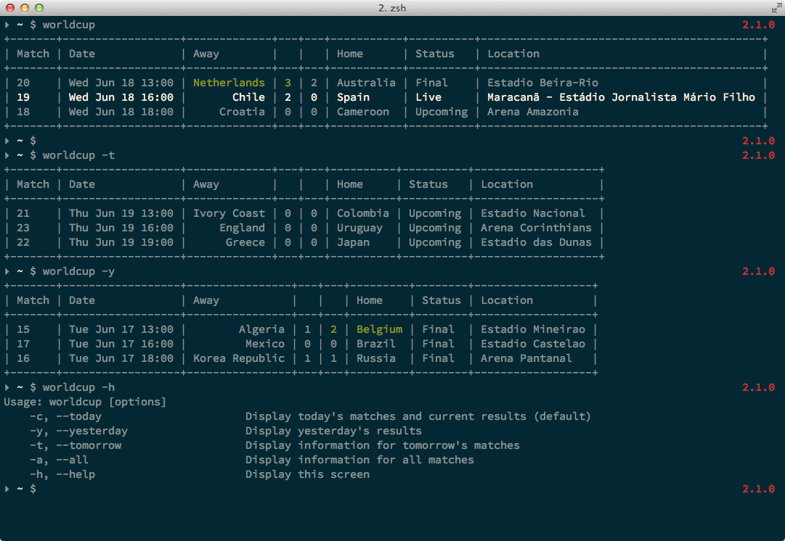

# World Cup 2014

Provides command line access to World Cup 2014 information and results.
Uses Soccer for Good API http://worldcup.sfg.io/. Inspired by https://github.com/fatiherikli/worldcup (Python) and John Oliver. Gives you slightly more information than googling "world cup".

## Installation

    $ gem install worldcup-2014

## Usage

    $ worldcup [options]
        -c, --today                      Display today's matches and current results (default)
        -y, --yesterday                  Display yesterday's results
        -t, --tomorrow                   Display information for tomorrow's matches
        -a, --all                        Display information for all matches
        -h, --help                       Display this screen

## Results

## Contributing

1. Fork it ( https://github.com/hpoydar/worldcup/fork )
2. Create your feature branch with a spec (`git checkout -b my-new-feature`)
3. Commit your changes (`git commit -am 'Add some feature'`)
4. Push to the branch (`git push origin my-new-feature`)
5. Create a new Pull Request
